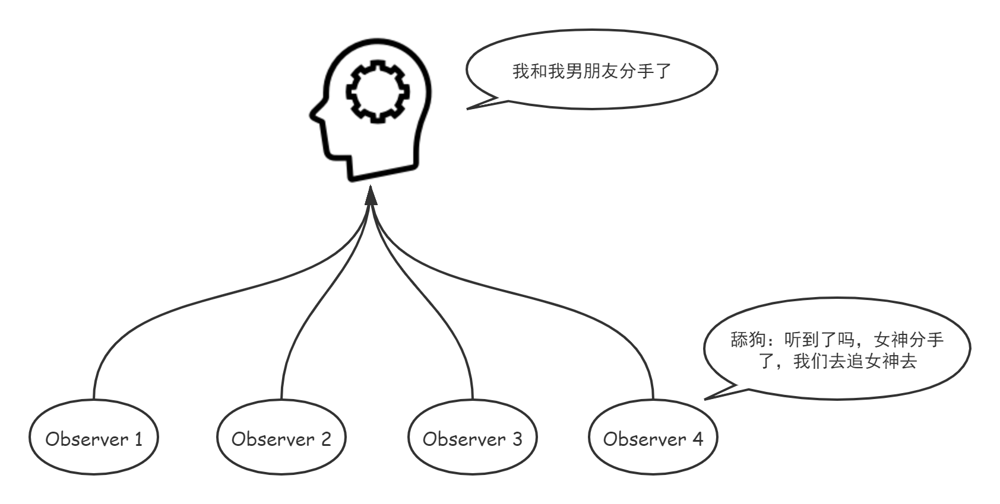

# ReactiveX 响应式编程

## 1. 观察者模式

**观察者模式**是[软件设计模式](https://zh.wikipedia.org/wiki/軟件設計模式)的一种。在此种模式中，一个目标对象管理所有相依于它的观察者对象，并且在它本身的状态改变时主动发出通知。这通常透过呼叫各观察者所提供的方法来实现。**此种模式通常被用来实时事件处理系统。**

**观察者模式又叫发布订阅模式（Publish/Subscribe）**，它定义了一种一对多的关系，让多个观察者对象同时监听某一个主题对象，这个主题对象的状态发生变化时就会通知所有的观察者对象，使得它们能够自动更新自己。

观察者模式的核心思想是: 1. 观察者和被观察者抽象耦合、2. 需要一套改变时的触发机制

观察者模式也有一些缺点，例如：1、如果一个被观察者对象有很多的直接和间接的观察者的话，将所有的观察者都通知到会花费很多时间。 2、**如果在观察者和观察目标之间有循环依赖的话，观察目标会触发它们之间进行循环调用**，可能导致系统崩溃。 3、观察者模式没有相应的机制让观察者知道所观察的目标对象是**怎么发生变化**的，而仅仅只是知道观察目标发生了变化。

对于观察者模式的简单实现，可以参考文档[《设计模式之——观察者模式》](https://www.runoob.com/design-pattern/observer-pattern.html)

## 2. 迭代器模式

迭代器（Iterator）模式，又叫做游标（Cursor）模式。它提供一种方法顺序访问一个聚合对象中的各个元素，而又不需要暴露该对象的内部表示。迭代器模式可以把迭代的过程从业务逻辑中分离出来，在使用迭代器模式之后，**即使不关心对象的内部构造，也可以按顺序访问其中的每个元素。**

**使用场景：** 1、访问一个聚合对象的内容而无须暴露它的内部表示。 2、需要为聚合对象提供多种遍历方式。 3、为遍历不同的聚合结构提供一个统一的接口。

**缺点：** 迭代器模式只能单向访问，不能恢复

## 3. Observable

RxJava是基于观察者模式和迭代器模式以函数式编程思维来实现的。RxJava中含有两个基本概念：Observables 与 Observer。Observables 作为被观察者，是一个值或事件的流集合；而 Observer 则作为观察者，根据 Observables 进行处理。

Observables 与 Observer 之间的订阅发布关系(观察者模式) 如下：

- **订阅**：Observer 通过 Observable 提供的 subscribe() 方法订阅 Observable。
- **发布**：Observable 通过回调 next 方法向 Observer 发布事件。

