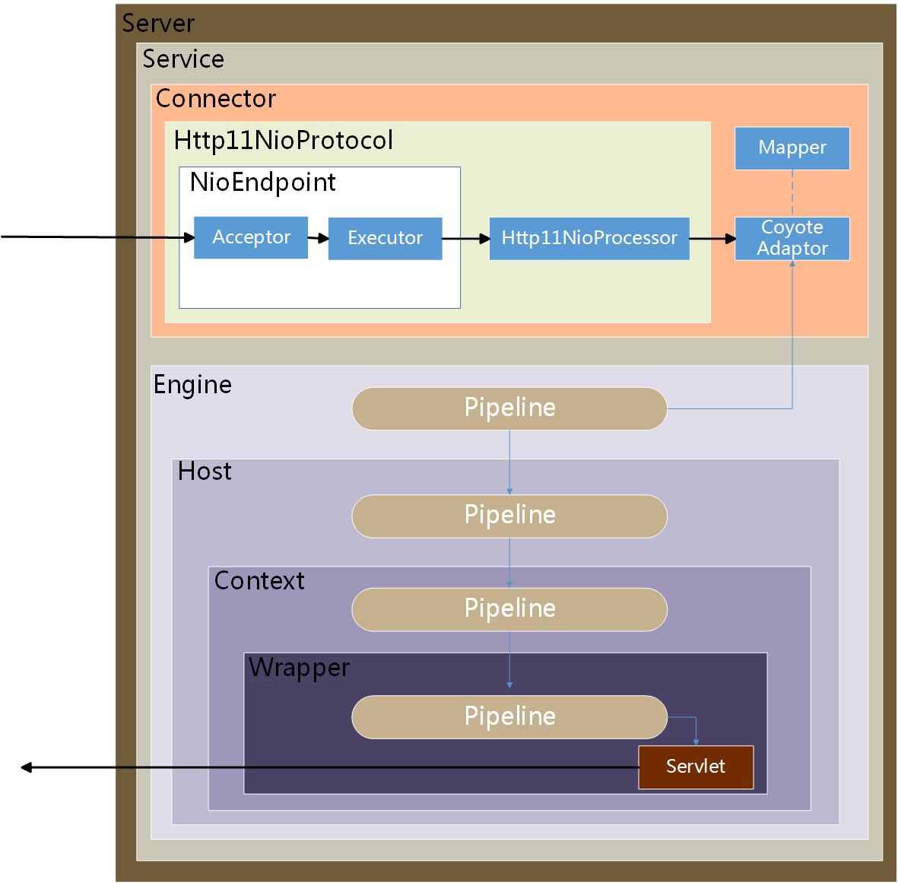

# 基于Servlet3异步特性完成请求隔离

## 1. Servlet3新特性

<div align=center></div>

上面是Tomcat的主要架构图，异步特性主要发生在Connector中。在Servlet3之前，仅仅支持BIO，从接收到HTTP请求到完成处理返回响应，所有的操作都是在Tomcat中的同一个线程内完成的，而Tomcat内置默认的线程数是100，也就是说如果同时有多于100的请求，Tomcat只能处理100，剩下的请求需要等待，也就是被阻塞了。

Servlet3.0起开始支持异步特性。接收到request请求之后，由tomcat工作线程从HttpServletRequest中获得一个异步上下文AsyncContext对象，然后由tomcat工作线程把AsyncContext对象传递给业务处理线程，同时tomcat工作线程归还到工作线程池，这一步就是异步开始。在业务处理线程中完成业务逻辑的处理，生成response返回给客户端。在Servlet3.0中虽然处理请求可以实现异步，但是InputStream和OutputStream的IO操作还是阻塞的，当数据量大的request body 或者 response body的时候，就会导致不必要的等待。从Servlet3.1以后增加了非阻塞IO，需要tomcat8.x支持。

请求异步化能得到许多好处:

* 基于NIO能处理更多的并发连接数
* 请求解析和业务处理线程池分离，达到请求隔离的效果
* 根据业务重要性对业务进行分级，分配到不同的线程池
* 分级后的线程池能够更加适合监控，运维，降级

## 2. 如何使用Servlet3.0的异步特性

1、声明Servlet，增加asyncSupported属性，开启异步支持。`@WebServlet(urlPatterns = "/AsyncLongRunningServlet", asyncSupported = true)`
2、通过request获取异步上下文AsyncContext。`AsyncContext asyncCtx = request.startAsync()`;
3、开启业务逻辑处理线程，并将AsyncContext 传递给业务线程。`executor.execute(new AsyncRequestProcessor(asyncCtx, secs));`
4、在异步业务逻辑处理线程中，通过asyncContext获取request和response，处理对应的业务。
5、业务逻辑处理线程处理完成逻辑之后，调用AsyncContext 的complete方法。`asyncContext.complete()`;从而结束该次异步线程处理

## 3. 使用Servlet3.0异步完成请求隔离示例

1. **声明Servlet，处理前来的HTTP请求，开启异步特性**

```java
//接收HTTP请求的Servlet
@WebServlet(urlPatterns = "/async", asyncSupported = true)
public class HTTPReceiverServelet extends HttpServlet{
    private static final long serialVersionUID = 1L;
    
    protected void doGet(HttpServletRequest request, HttpServletResponse response){
    	/** 前置业务逻辑 **/
        
        request.setAttribute("org.apache.catalina.ASYNC_SUPPORTED", true);
        //请求的时间
        int time = Integer.valueOf(request.getParameter("time"));
        //异步开始
        AsyncContext asyncContext = request.startAsync();
        //添加异步监听器，非常重要，异步处理的完成是通过监听器察觉到的
        asyncContext.addListener(new MyAsyncListener());
        //异步处理超时时间，针对有时间要求的异步请求
        asyncContext.setTimeout(1000);
        //这里就是请求隔离的的开始了，将tomcat中的线程转交给业务线程池处理
        ThreadPoolExecutor executor = (ThreadPoolExecutor) request.getServletContext().getAttrbute("executor");
        executor.execute(new MyAsyncProcessor(asyncContext, time))
    }
}
```

2. **异步监听器，负责监听异步任务的完成**

```java
@WebListener
public class MyAsyncListener extends AsyncListener{
    @Override
    public void onComplete(...){}
    
    @Override
    public void onError(...){}
    
    @Override
    public void onStartAsync(...){}
    
    @Override
    public void onTimeout(...){}
}
```

3. **转交给的业务处理器**

```java
public class MyAsyncProcessor implements Runnable{
    private AsyncContext asyncContext;
    private int time;
    
    public MyAsyncProcessor(AsyncContext asyncContext, int time){
        this.asyncContext = asyncContext;
        this.time = time;
    }
    
    @Override
    public void run(){
        //业务逻辑处理
    }
}
```


