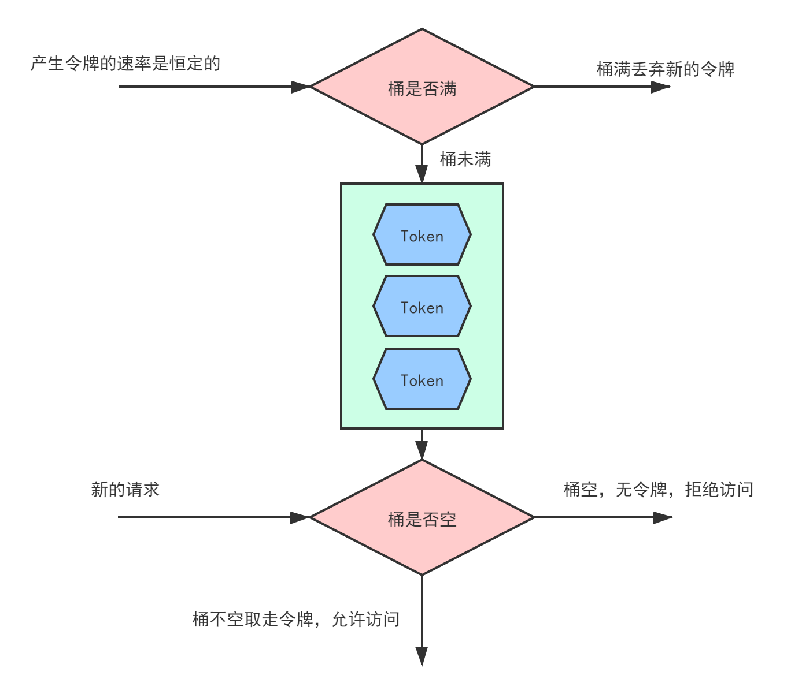
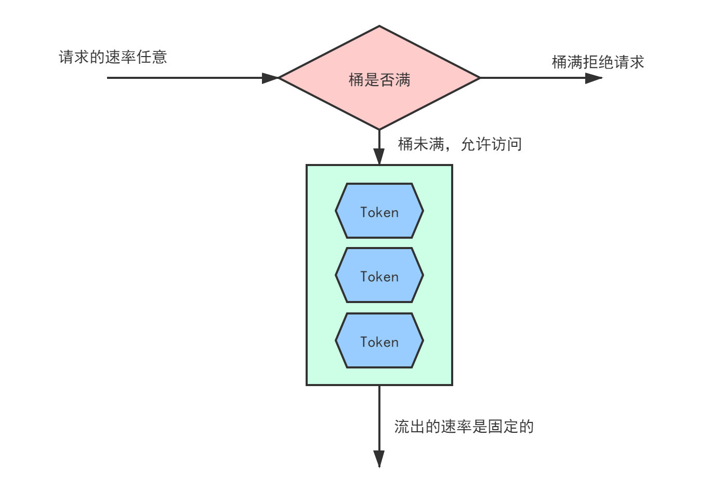

# 高并发限流保护原理与案例

## 1. 为什么要限流

限流的目的通过对并发访问/请求进行限速或者一个时间窗口内的请求进行限速来保护系统，一旦达到限制速率则可以拒绝服务(定向到错误页面或者告知系统资源已经没有了，需要等待)、降级(返回兜底数据或者默认数据)。在压测阶段找出每个子系统的处理峰值，然后设置峰值阈值来防止系统过载。

一般高并发框架中常见的限流措施有:

* **限制总的并发数** : 限制数据库连接池的大小，线程池大小
* **限制瞬时并发数** : 比如Nginx的limit_conn模块，用来限制瞬时并发连接数
* **限制时间窗口内的平均速率** : 如Guava的RateLimiter，Nginx的limit_req模块
* **限制远程接口的调用速率**
* **限制MQ的消费速率**
* **根据其他一些硬件资源条件进行限流，例如网络连接数，网络流量，CPU或者内存的负载来限流**

## 2. 限流算法

### 2.1 令牌桶算法

<div align=center></div>

令牌桶算法的描述如下:

1. 假设限制速率位2r/s，表示每500ms向桶中添加r个令牌
2. 桶中最多放入b个令牌，当桶满的时候，新添加的令牌会被丢弃或者拒绝
3. **当一个n个字节大小的数据包到达的时候，将从桶中删除n个令牌**
4. 如果桶中的令牌不够一次请求(不足n个，或者为空)，拒绝请求

伪代码如下:

```java
//令牌桶算法
public static boolean allow(Request request){
    synchronized(bucket){	//这里用了同步方式，性能会下降，仅做主要思想的说明，实际上应该采用CAS的思想
        if(request.len() > bucket.currentCapacity)
            return false;
        bucket.currentCapacity -= request.len();
        return true;
    }
}
```

### 2.2 漏桶算法

<div align=center></div>

漏桶的算法描述为:

1. 桶容量固定，**按照固定速率流出token**
2. 请求的速率任意，桶满(漫出来)，拒绝请求，反之允许请求

漏桶的伪代码如下:

```java
public static boolean allow(Request request){
    synchronized(bucket){
        if(bucket.maxCapacity <= bucket.currentCapacity)
            return false;
        bucket.currentCapacity -= request.len();
        return true;
    }
}
```

## 3. 应用级限流

### 3.1 配置Tomcat实现限流

Tomcat限流主要针对的是对**请求连接数进行限流**，针对得是**控制请求连接的阈值**，在tomcat配置文件server.xml中，可以通过两个参数进行配置

```xml
<Connectorport="8080"protocol="HTTP/1.1"connectionTimeout="20000"redirectPort="8443"        maxConnections="800"acceptCount="500"maxThreads="400"/>
```

* **acceptCount**：如果tomcat的线程都忙于响应，新来的连接请求会进入队列排队，acceptCount指示了这个队列的最大长度
* **maxConnections**：瞬时的最大连接数，超出部分进入等待队列
* **maxThreads**：Tomcat能立刻处理的最大连接数

### 3.2 MySQL限流

这个暂时先放一下，等我看完MySQL45讲再补

### 3.3 接口限流

> #### Redis + Lua实现分布式接口限流

**缓存的目的是提升系统访问速度和增大系统能处理的容量**，可谓是抗高并发流量的银弹；而**降级是当服务出问题或者影响到核心流程的性能则需要暂时屏蔽掉**，待高峰或者问题解决后再打开；而**有些场景并不能用缓存和降级来解决**，比如稀缺资源（秒杀、抢购）、写服务（如评论、下单）、频繁的复杂查询（评论的最后几页），因此需有一种手段来限制这些场景的并发/请求量，即限流。

一提到接口限流，最容易想到的就是用redis做限流数据库，每一个接口对应一个redis key，这种方法看似可行，但是单纯的业务逻辑代码有时会存在并发问题，为了解决并发问题又要增加业务逻辑。因此可以使用Redis+Lua实现接口的限流，Lua脚本能保证操作的原子性，操作中途失败会回滚，通过`now`, `ttl`, `expired`, `max`可以实现不同维度的限流，Lua脚本代码如下:

```lua
-- 下标从 1 开始
local key = KEYS[1]
local now = tonumber(ARGV[1])
local ttl = tonumber(ARGV[2])
local expired = tonumber(ARGV[3])
-- 最大访问量
local max = tonumber(ARGV[4])

-- 清除过期的数据
-- 移除指定分数区间内的所有元素，expired 即已经过期的 score
-- 根据当前时间毫秒数 - 超时毫秒数，得到过期时间 expired
redis.call('zremrangebyscore', key, 0, expired)

-- 获取 zset 中的当前元素个数
local current = tonumber(redis.call('zcard', key))
local next = current + 1

if next > max then
    -- 达到限流大小 返回 0
    return 0;
else
    -- 往 zset 中添加一个值、得分均为当前时间戳的元素，[value,score]
    redis.call("zadd", key, now, now)
    -- 每次访问均重新设置 zset 的过期时间，单位毫秒
    redis.call("pexpire", key, ttl)
    return next
end
```

在业务代码层，利用切面实现限流，定义`@RateLimiter`注解，在切面逻辑内通过RedisScript执行Lua脚本，业务代码如下:

```java
@Slf4j
@Aspect
@Component
@RequiredArgsConstructor(onConstructor_ = @Autowired)
public class RateLimiterAspect {

    private final static String SEPARATOR = ":";
    private final static String REDIS_LIMIT_KEY_PREFIX = "limit:";
    private final StringRedisTemplate stringRedisTemplate;
    private final RedisScript<Long> limitRedisScript;

    @Pointcut("@annotation(com.speily.lock.annotation.RateLimiter)")
    public void rateLimit() {

    }

    @Around("rateLimit()")
    public Object pointcut(ProceedingJoinPoint point) throws Throwable {
        MethodSignature signature = (MethodSignature) point.getSignature();
        Method method = signature.getMethod();
        // 通过 AnnotationUtils.findAnnotation 获取 RateLimiter 注解
        RateLimiter rateLimiter = AnnotationUtils.findAnnotation(method, RateLimiter.class);
        if (rateLimiter != null) {
            String key = rateLimiter.key();
            // 默认用类名+方法名做限流的 key 前缀
            if (StrUtil.isBlank(key)) {
                key = method.getDeclaringClass().getName()+StrUtil.DOT+method.getName();
            }
            // 最终限流的 key 为 前缀 + IP地址
            // TODO: 此时需要考虑局域网多用户访问的情况，因此 key 后续需要加上方法参数更加合理
            key = key + SEPARATOR + IpUtil.getIpAddr();

            long max = rateLimiter.count();
            long timeout = rateLimiter.timeout();
            TimeUnit timeUnit = rateLimiter.timeUnit();
            boolean limited = shouldLimited(key, max, timeout, timeUnit);
            if (limited) {
                throw new LimitException("请求次数超限:[" + max + "/" + timeout + timeUnit + "]");
            }
        }

        return point.proceed();
    }

    private boolean shouldLimited(String key, long max, long timeout, TimeUnit timeUnit) {
        // 最终的 key 格式为：
        // limit:自定义key:IP
        // limit:类名.方法名:IP
        key = REDIS_LIMIT_KEY_PREFIX + key;
        // 统一使用单位毫秒
        long ttl = timeUnit.toMillis(timeout);
        // 当前时间毫秒数
        long now = Instant.now().toEpochMilli();
        long expired = now - ttl;
        // 注意这里必须转为 String,否则会报错 java.lang.Long cannot be cast to java.lang.String
        Long executeTimes = stringRedisTemplate.execute(limitRedisScript, Collections.singletonList(key), now + "", ttl + "", expired + "", max + "");
        if (executeTimes != null) {
            if (executeTimes == 0) {
                log.error("【{}】在单位时间 {} 毫秒内已达到访问上限，当前接口上限 {}", key, ttl, max);
                return true;
            } else {
                log.info("【{}】在单位时间 {} 毫秒内访问 {} 次", key, ttl, executeTimes);
                return false;
            }
        }
        return false;
    }

}
```

> #### Guava实现单机接口限流

* **Guava Cache实现接口限流**

```java
//在指定时间窗口内完成最大指定次数的限流
LoadingCache<Long, AtomicLong> limiter = CacheBuilder.newBuilder()
    .expireAfterWrite(2, TimeUnit.SECONDS)	//时间窗口为2s
    .build(new CacheLoader<Long, AtomicLong>(){
        @Override
        public AtomicLong load(Long seconds) throws Exception{
            return new AtomicLong(0);
        }
    });
long max = 1000;	//最大请求数1000
while(true){
    //得到当前的秒
    long currentSeconds = System.currentTimeMills() / 1000;
    if(limiter.get(currentSeconds).incrementAndGet() > max){
        //被限流了
    }
    //正常业务逻辑
}
```

* **Guava RateLimiter实现限流**

```java
RateLimiter limiter = RateLimiter.create(1.0);	//每秒处理的量为1个
limiter.acquire();	//阻塞方法，获取不到就阻塞，区别于前面，不是直接拒绝请求
```

> #### Redisson实现分布式接口限流

```java
public boolean allow() {
    //分布式场景下的限流
    RMapCache<String, Integer> limiter =
        redisClient.getMapCache(key, IntegerCodec.INSTANCE);
    Integer count;
    try {
      limiter.putIfAbsent(key, 0, 1L, TimeUnit.SECONDS);
      count = limiter.addAndGet(key, 1);
      log.info("get redis counter:{}", count);
      if (count <= max) {
        //此处是你要执行的代码
        return true;
      }
      log.warn("超过限流:{}", count);
    } catch (Exception e) {
      log.error("err", e);
    }
    return false;
  }
```


